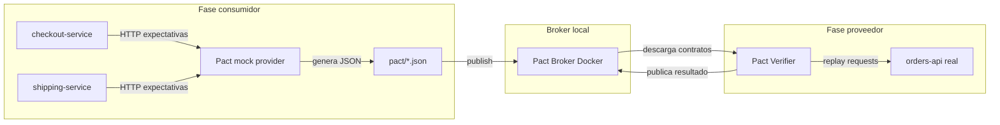
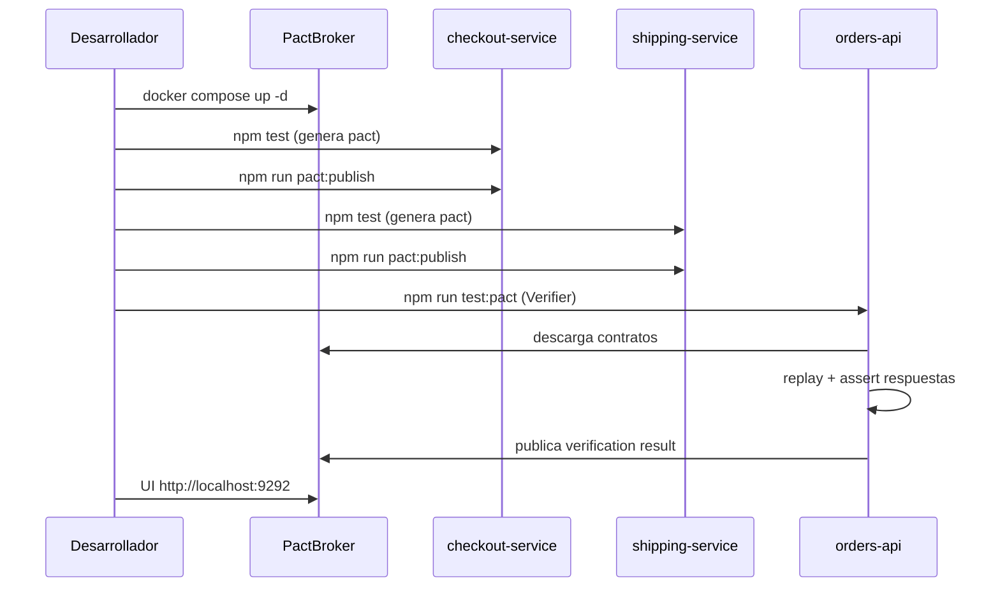

# Consumer Driven Contract Testing con Pact

## Introducción

En **Consumer Driven Contract Testing**, el consumidor define las expectativas de la interacción con un proveedor. El contrato especifica las peticiones que el consumidor enviará y las respuestas que espera recibir. Los contratos se generan durante la fase de creación y prueba: el marco Pact levanta un servidor simulado del proveedor para validar que el consumidor gestiona correctamente las respuestas definidas.

El proveedor, por su parte, es responsable de verificar cada contrato relacionado con él. Recupera los contratos del Pact Broker, ejecuta las peticiones definidas contra su código real y comprueba que las respuestas cumplen lo acordado.

Esta PoC demuestra el flujo completo con Node.js, Express, Jest y un Pact Broker local en Docker.

## Metodología Pact

### Rol del consumidor

- Define contratos como **contratos mínimos viables**: solo los campos que realmente usa.
- Escribe tests Pact que describen peticiones HTTP y respuestas esperadas.
- Si los tests pasan, se genera un archivo `.json` (contrato Pact) que se publica en el broker.

### Rol del proveedor

- No conoce los contratos hasta la fase de verificación.
- Descarga contratos del broker durante sus tests.
- Pact replay las peticiones contra el API real y valida las respuestas.
- Publica el resultado de la verificación en el broker.

### Provider states

Los **provider states** permiten preparar datos de prueba antes de cada interacción. Por ejemplo, `"an order with id 1 exists"` indica al proveedor que debe tener un pedido con id 1 disponible cuando el Verifier ejecute la petición.

### Pact Broker

Centraliza contratos y resultados de verificación. Permite responder preguntas como “¿puedo desplegar esta versión del proveedor sin romper a mis consumidores?” (can-i-deploy).

Repositorio oficial: [pact-foundation/pact_broker](https://github.com/pact-foundation/pact_broker). En esta PoC se levanta con la imagen Docker `pactfoundation/pact-broker` definida en `docker-compose.yml`.

## Arquitectura



## Participantes

| Participante       | Rol        | Necesidad                                          |
| ------------------ | ---------- | -------------------------------------------------- |
| `orders-api`       | Proveedor  | REST API con datos en memoria                      |
| `checkout-service` | Consumidor | Detalle completo del pedido para cobro             |
| `shipping-service` | Consumidor | Solo `id`, `status` y `shippingAddress` para envío |

Endpoints del proveedor:

- `GET /orders/:id` — devuelve un pedido
- `GET /health` — health check
- `POST /setup` — provider states para verificación Pact

## Estructura del repositorio

```
consumer-driven-testing/
├── docker-compose.yml
├── README.md
├── docs/
│   └── consumer-driven-testing.md
├── .env.example
├── orders-api/
├── checkout-service/
└── shipping-service/
```

Cada servicio es un proyecto Node.js independiente con su propio `package.json`, `jest.config.js` y tests.

## Stack técnico

| Componente  | Tecnología                                                                   |
| ----------- | ---------------------------------------------------------------------------- |
| Runtime     | Node.js 20+                                                                  |
| HTTP        | Express                                                                      |
| Tests       | Vitest + `@pact-foundation/pact` v16                                         |
| Contratos   | `@pact-foundation/pact` v16 (`PactV3`, `MatchersV3`, `Verifier`)             |
| Broker      | [Pact Broker](https://github.com/pact-foundation/pact_broker) local (Docker) |
| HTTP client | `fetch` nativo                                                               |

### Configuración Vitest

Cada proyecto incluye `vitest.config.js` para ejecutar tests en Node y transformar las dependencias de Pact v16:

```js
// vitest.config.js
module.exports = {
  test: {
    environment: 'node',
    globals: true,
    include: ['test/**/*.test.js'],
    testTimeout: 30000,
    deps: {
      inline: ['@pact-foundation/pact', 'https-proxy-agent', 'agent-base', 'axios'],
    },
  },
};
```

## Implementación por componente

### orders-api (proveedor)

- Store en memoria con pedidos de ejemplo.
- Respuesta `GET /orders/:id` con: `id`, `status`, `total`, `currency`, `items[]`, `shippingAddress`.
- Endpoint `POST /setup` para provider states.
- Test de verificación con `Verifier` que descarga contratos del broker.

Provider states soportados:

- `"an order with id 1 exists"` — seed del pedido 1
- `"order 1 does not exist"` — store vacío para ese pedido

### checkout-service (consumidor)

- Cliente HTTP que obtiene detalle de pedido para checkout.
- Contrato Pact con campos: `id`, `status`, `total`, `currency`, `items`.

### shipping-service (consumidor)

- Cliente HTTP que obtiene datos mínimos para envío.
- Contrato Pact con campos: `id`, `status`, `shippingAddress` (menos campos que checkout).

## Flujo de trabajo



### Comandos paso a paso

```bash
# Levantar broker
docker compose up -d

# Consumidor 1
cd checkout-service
npm install
npm test
npm run pact:publish

# Consumidor 2
cd ../shipping-service
npm install
npm test
npm run pact:publish

# Proveedor
cd ../orders-api
npm install
npm run test:pact
```

Con `PACT_USE_BROKER=true` en `.env`, el proveedor descarga contratos del broker y publica el resultado de verificación. Con `PACT_USE_BROKER=false`, verifica contra los archivos locales en `checkout-service/pacts/` y `shipping-service/pacts/` (útil para desarrollo sin Docker).

Variables de entorno (ver `.env.example`):

```
PACT_BROKER_BASE_URL=http://localhost:9292
PACT_BROKER_USERNAME=pact
PACT_BROKER_PASSWORD=pact
PACT_USE_BROKER=true
```

## Criterios de éxito

La PoC se considera exitosa cuando:

1. Cada consumidor genera su archivo `.json` en `pacts/`.
2. Ambos contratos aparecen en el broker UI (`http://localhost:9292`).
3. `orders-api` pasa la verificación contra **ambos** contratos.
4. El broker muestra verification results publicados para el proveedor.
5. (Opcional) Romper un campo requerido en el proveedor hace fallar la verificación.

## Alcance y limitaciones

Fuera del alcance de esta PoC:

- PactFlow (cloud) — se usa broker local en Docker
- CI/CD en GitHub Actions
- Base de datos real (memoria es suficiente)
- Autenticación OAuth/JWT
- TypeScript

## Próximos pasos

- Integrar verificación en pipeline CI/CD
- Usar `can-i-deploy` antes de despliegues
- Migrar a PactFlow en entornos compartidos
- Añadir más interacciones y estados de proveedor
- Evaluar migración a TypeScript

## Riesgos y mitigaciones

| Riesgo                                  | Mitigación                                                       |
| --------------------------------------- | ---------------------------------------------------------------- |
| Puertos en conflicto (3000, 9292)       | Variables `PORT`; documentados en README                         |
| Nombres de participantes inconsistentes | Constantes: `orders-api`, `checkout-service`, `shipping-service` |
| Provider states no implementados        | Endpoint `POST /setup` desde el inicio                           |
